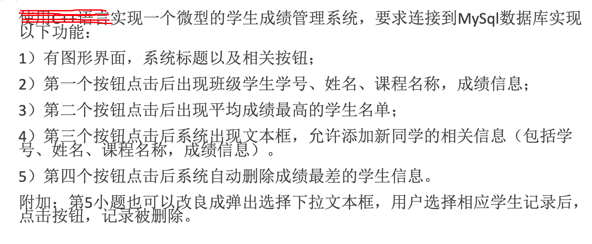

# Student_Info_GUI
 学生管理系统图形化界面演示

https://img.shields.io/badge/<MUST>-<DataBase>-<orange>


### Background




### Environment

```
Python 3.7
MySQL 8.0.23
PyMSQL
```


### Demo 

####  1.`SHOW ALL` 


#### 2.`CLEAR ALL`


#### 3.`BEST STU`


#### 4.`ADD`


#### 5.`DELETE ONE`


### File structure

 - `Student_Info.sql`
    - 这是数据库文件，用户可以将此sql导入数据库系统即可得到跟示例中相同的数据库。
 - `Student_Info_Demo.py`
    - 这是演示文件，用户在导入数据库之后，在此文件中connect()方法中修改参数为自己的登陆本地数据库的用户名和密码后，即可运行此演示文件
 - `Student_Info_Draft.sql`
   	- 这是建立数据库时建立的草稿文件，这份文件中记录了如何查询学生信息，如何找出成绩最好的学生，如何将SQL语句格式化以及如何删除学生信息
 - `Py_Conn_Sql.py`
   	- 这是利用PyMYSQL库连接mysql的演示（模版），此文件中注释详细，比喻生动，用户可以快速上手


### Bug List

作者要去背单词了！！！！


### To Do List


### 
